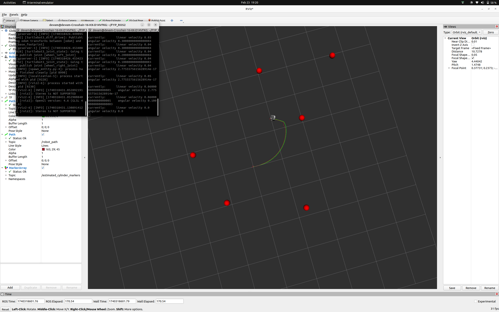

# **EKF Localization for TurtleBot3 (ROS2 Humble)**  



This repository implements **Extended Kalman Filter (EKF) localization** for **TurtleBot3** in **ROS2 Humble**, utilizing Gazebo and RViz for simulation and visualization.


## **Features**  

- **EKF-Based Localization:**  
  - Integrates **odometry and laser scan** data for state estimation.  
  - Publishes estimated pose (`/pose_with_cov_stamped`).  
- **Trajectory Visualization:**  
  - EKF-estimated trajectory (`/robot_path`).  
  - Raw odometry trajectory (`/real_robot_path`).  
- **Landmark Detection:**  
  - Identifies cylindrical landmarks and publishes markers (`/cylinder_markers`).  
- **Optimized Launch Sequence:**  
  - **Gazebo launches first** to prevent delays in sensor data.  
  - **5-second wait time** ensures simulation is ready.  
  - **RViz starts automatically** with predefined configurations.  

---

## **Installation & Setup**  

### **1. Clone the Repository**  

```bash
cd ~/FYP_ROS2/src
git clone https://github.com/your_username/ekf_localization.git
```

### **2. Build the Package**  

```bash
cd ~/FYP_ROS2
colcon build --symlink-install
```

### **3. Source the Environment**  

```bash
source ~/FYP_ROS2/install/setup.bash
source ~/turtlebot3_ws/install/setup.bash
```

---

## **Running the Simulation**  

To launch the **Gazebo world**, **EKF localization**, and **RViz**, run:  

```bash
ros2 launch ekf_localization ekf_localization.launch.py
```

### **Launch Sequence:**  
1. **Gazebo loads the TurtleBot3 world**  
2. **A 5-second delay** ensures the simulation is initialized  
3. **EKF node starts processing sensor data**  
4. **RViz launches** with the predefined configuration  

---

## **Project Structure**  

```
ekf_localization/
├── ekf_localization
│   ├── __init__.py
│   └── ekf_localization.py  # Main EKF node
├── launch
│   └── ekf_localization.launch.py  # Launch file
├── rviz
│   └── default.rviz  # Default RViz configuration (Download)
├── worlds
│   └── fyp_world.world  # Gazebo world (Download)
├── package.xml
└── setup.py
```

---

## **Troubleshooting**  

### **1. No LaserScan Data Received**  
- The EKF node **waits until valid `/scan` data** is received before proceeding.  
- Ensure Gazebo has fully initialized before launching the EKF node.  

### **2. Workspace Not Sourced**  
- If ROS2 can’t find the package, verify that the correct workspaces are sourced:  
  ```bash
  source ~/FYP_ROS2/install/setup.bash
  source ~/turtlebot3_ws/install/setup.bash
  ```

### **3. RViz Not Showing Expected Visuals**  
- If RViz doesn’t load properly, manually load `default.rviz` via:  
  ```bash
  rviz2 -d ~/FYP_ROS2/src/ekf_localization/rviz/default.rviz
  ```
### **4. Gazebo World Not Launching**  
 If the Gazebo world does not load correctly, follow these steps to resolve the issue:

1. **Manually place the world file**  
   - Move your `fyp_world` file to the following directory:  
     ```bash
     mv /path/to/fyp_world /home/devam/turtlebot3_ws/src/turtlebot3_simulations/turtlebot3_gazebo/worlds/
     ```

2. **Update the launch file**  
   - Open the `empty_world.launch.py` file in a text editor:  
     ```bash
     nano /home/devam/turtlebot3_ws/src/turtlebot3_simulations/turtlebot3_gazebo/launch/empty_world.launch.py
     ```
   - Locate the line that specifies the world file and modify it to use `fyp_world`:  
     ```python
     world_name = 'fyp_world'
     ```
   - Save and exit the file.  

After making these changes, try launching the world again.


---

## **Contributing**  
We welcome contributions! If you have improvements, bug fixes, or new features to add, feel free to submit a pull request. Before contributing, please follow these steps:  

1. **Fork the repository**  
2. **Create a feature branch**  
   ```bash
   git checkout -b feature-branch-name
   ```
3. **Commit changes** with clear messages  
4. **Push to your fork** and submit a pull request  

For major changes, please open an issue to discuss proposed modifications.  

---

## **License**  
This project is open-source. Please check `LICENSE` for details.  

## **Maintainer**  
- **Name:** Devam Shah  
- **Email:** devamshah82@gmail.com  

